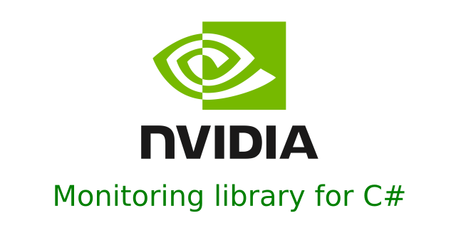

# 

### The nvidia monitoring library wrapper written in c#. Please, read the [documentation](https://docs.nvidia.com/deploy/nvml-api/nvml-api-reference.html#nvml-api-reference) for better understand what is nvml.

* Example on how to get running processes list
```csharp
try
{
    NvGpu.NvmlInitV2();
    var device = IntPtr.Zero;
    device = NvGpu.NvmlDeviceGetHandleByIndex(0);
    var (list, count) = NvGpu.NvmlDeviceGetComputeRunningProcesses(device);
    NvGpu.NvmlShutdown();
}
catch (Exception e)
{
    Assert.Fail(e.ToString());
}
```

* Example on how to retrieve gpu temperature
```csharp
try
{
    var device = IntPtr.Zero;
    NvGpu.NvmlInitV2();
    device = NvGpu.NvmlDeviceGetHandleByIndex(0);
    var temperature = NvGpu.NvmlDeviceGetTemperature(device, NvmlTemperatureSensor.NVML_TEMPERATURE_GPU);
    if (!(temperature >= 40 && temperature <= 80))
    {
        Assert.Fail("Cant get temperature.");
    }
    NvGpu.NvmlShutdown();
}
catch (Exception e)
{
    Assert.Fail(e.ToString());
}
```

* The wrapper is in working status. Below we have a list of migrated modules
- [x] Ititialization and Cleanup
- [x] System Queries
- [] Device Queries
- [] Unit Queries
- [] Unit Commands
- [] Device Commands
- [] Event Handling Methods
- [] Error Reporting
